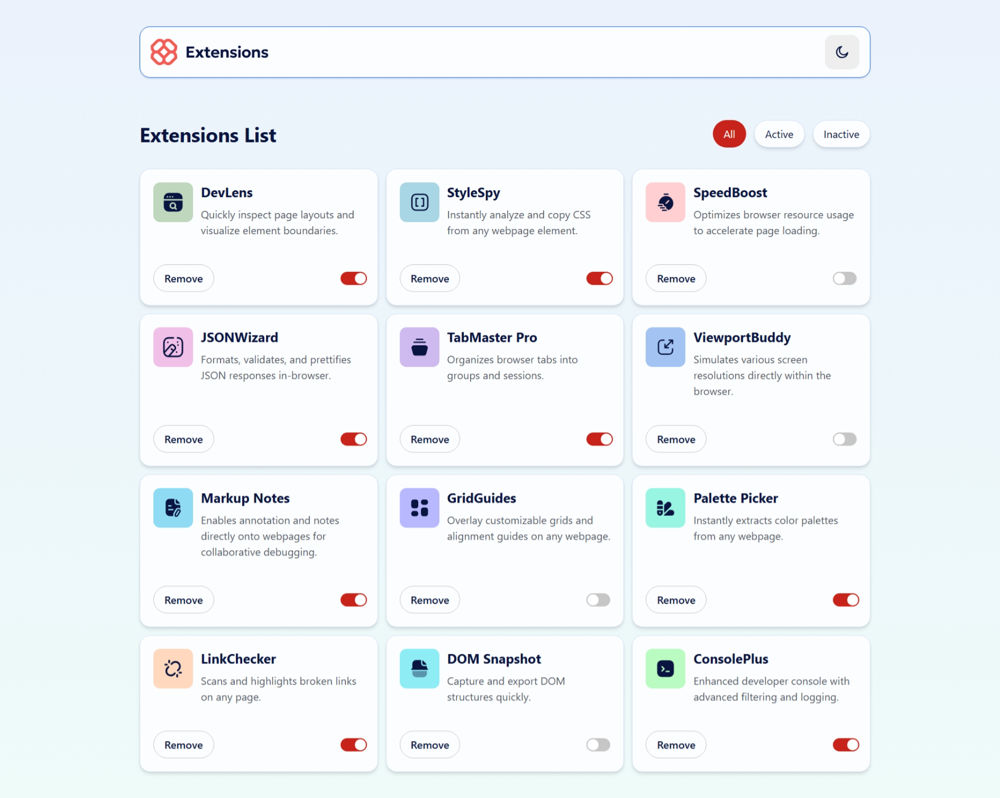

# Frontend Mentor - Browser Extensions Manager UI Solution

This is a solution to the [Browser Extensions Manager UI challenge on Frontend Mentor](https://www.frontendmentor.io/challenges/browser-extension-manager-ui-yNZnOfsMAp).  
Frontend Mentor challenges help improve your coding skills by building realistic projects.

---

## Table of Contents

- [Frontend Mentor - Browser Extensions Manager UI Solution](#frontend-mentor---browser-extensions-manager-ui-solution)
  - [Table of Contents](#table-of-contents)
  - [Overview](#overview)
    - [The Challenge](#the-challenge)
    - [Screenshot](#screenshot)
    - [Links](#links)
  - [My Process](#my-process)
    - [Built With](#built-with)
  - [Author](#author)

---

## Overview

### The Challenge

Users should be able to:

- Toggle extensions between active and inactive states
- Filter active and inactive extensions
- Remove extensions from the list
- Select their color theme
- View the optimal layout for the interface depending on their device's screen size
- See hover and focus states for all interactive elements on the page

### Screenshot

### Links

- **Solution URL:** [Click here](https://www.frontendmentor.io/solutions/browser-extension-manager-ui---nextjs-d6hzO_gvaD)
- **Live Site URL:** [Live Demo](https://browser-extensions-manager-ui-murex.vercel.app/)

---

## My Process

### Built With

- Semantic HTML5 markup
- CSS custom properties
- Flexbox
- CSS Grid
- Mobile-first workflow
- [React](https://reactjs.org/) - JavaScript library
- [Next.js](https://nextjs.org/) - React framework
- [TailwindCSS](https://tailwindcss.com/) - Utility-first CSS framework

---

## Author

- Website - [iwaola.me](https://iwaola.me)
- Frontend Mentor - [@fawaziwalewa](https://www.frontendmentor.io/profile/fawaziwalewa)
- GitHub - [fawaziwalewa](https://github.com/fawaziwalewa)
- Twitter - [@IwalewaFawaz](https://twitter.com/IwalewaFawaz)
